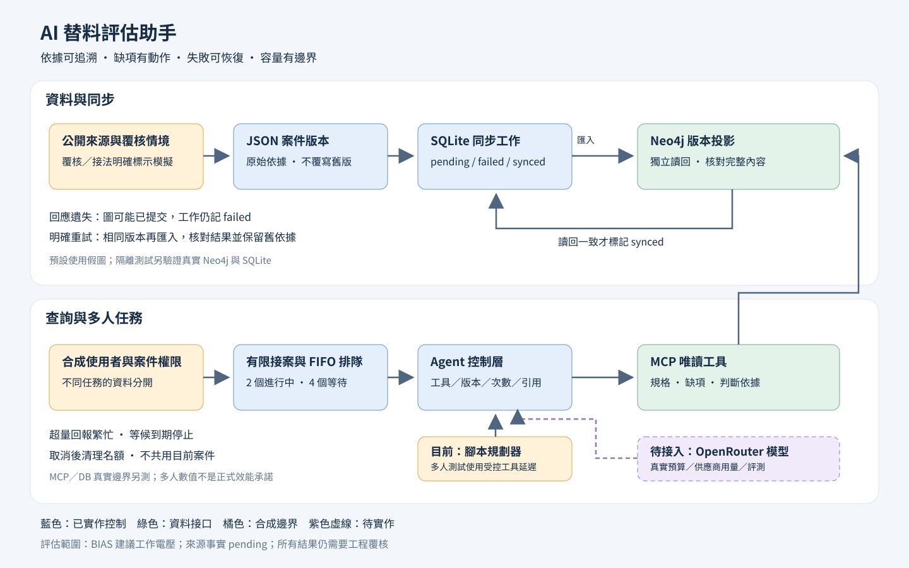

# AI 替料評估助手

An evidence-based component review demo with Neo4j, read-only MCP, durable projection recovery, and bounded concurrent tasks.

從公開的 [TI 替料提問](https://e2e.ti.com/support/power-management-group/power-management/f/power-management-forum/1222180/lm5155-replace-lt8301ess)出發，協助整理候選 LM5155 的條件規格、判斷依據、缺項與下一步。原始元件是 LT8301ESS；第一版只檢查 BIAS 建議工作電壓，不能核准整顆料替換。

> 判斷有依據、有規則；未知有原因，補齊有動作、有標準。



[完整架構圖](docs/architecture.md) · [五分鐘 Demo](docs/demo.md) · [驗證與限制](docs/verification.md)

## 一條指令看完整故事

Python 3.11 以上，不需要 API key、Docker 或網路。每次使用新的輸出目錄。

```sh
python system_demo.py --simulate-review --out output/demo-01
```

它展示：

1. 保存不可覆寫的案件版本，從 unknown 到條件符合／違反／仍缺資料。
2. 用真實 SQLite 記錄同步工作；刻意模擬圖已提交但回應遺失。
3. 工作保持 failed，重開 ledger、明確重試、讀回核對，舊版案件不被覆蓋。
4. 十個合成身分同時提交：2 個進行中、4 個等待、其餘回報繁忙。
5. 越權案件、非法工具和假引用被擋下，完成後清理名額。

結果、原始 bundle 和 ledger 保存在 output/demo-01。預設圖儲存是 fixture，規劃器是腳本；多人數值不是正式模型效能。

## 真實資料庫與 MCP

```sh
uv sync --extra mcp --frozen
docker pull neo4j@sha256:89d577f2e49606de76441eca8cf7a0fe88e594cbaac4d2a3d86c6e59676e2b1e
uv run --frozen --extra mcp python scripts/verify_neo4j.py --run-isolated --mcp --system-demo --readiness-seconds 420
```

需要 Docker 與 uv；只在新建的隔離容器寫入合成資料，腳本完成後停止自己的容器。它驗證真實 Neo4j、stdio MCP，以及 SQLite 同步失敗／恢復。版本和環境限制見[驗證紀錄](docs/verification.md)。

## 已實作與待接入

| 能力 | 狀態 |
| --- | --- |
| 條件規格與版本化工程證據 | 已實作 來源規格仍 pending |
| 不覆寫的覆核歷程與三種評估結果 | 已實作 Demo 的覆核與接法為合成資料 |
| Neo4j 投影與精確證據路徑 | 已實作 有獨立 real-engine suite |
| 三個唯讀 MCP 工具 | 已實作 官方 SDK 2.2.0 本機 stdio |
| 持久同步工作與明確重試 | 已實作 SQLite plus Neo4j adapter |
| 任務容量 排隊 取消 逾時 | 已實作 單事件迴圈與合成權限 fixture |
| 真實 LLM 規劃與模型評測 | 待接入 現在是腳本規劃 |
| 送出前美元預算保留與結算 | 設計階段 |
| HTTP MCP OAuth 多租戶登入 | 待實作 |
| 跨 worker 全域限制或持久佇列恢復 | 待實作 |
| EDA 模擬 實測或工程替料核准 | 未涵蓋 |

既有歷史 extraction smoke 模組不等於這個 Agent 已接上模型；公開 demo 不呼叫它們。使用任何付費路徑之前，必須重新核對模型、供應商、費率和試跑額度。

## 測試與防護驗證

```sh
python -m unittest discover -s tests -v
python scripts/verify_demo_guards.py
```

核心是 Python 標準函式庫；MCP 是可選 extra。Windows-specific 私有診斷測試與需要外部服務的測試會按環境跳過。防護驗證在暫存副本移除三個 guard，確認原測試失敗，再還原通過。詳見[執行結果](docs/verification.md)。

## 設計文章與程式入口

- [從 LM5155 理解 Neo4j 設計](articles/neo4j-practical-guide.md)
- [MCP 控制與多人延遲設計](articles/mcp-control-and-latency-design.md)
- [system_demo.py](system_demo.py)：展示入口與 adapters 組裝
- [projection_sync.py](projection_sync.py)：同步與核對流程
- [projection_adapters.py](projection_adapters.py)：SQLite／Neo4j 邊界
- [demo_service.py](demo_service.py)：接案 排隊與取消
- [agent_control.py](agent_control.py)：工具／快照／引用控制
- [evidence_mcp.py](evidence_mcp.py)：唯讀 MCP server
- [evaluation](evaluation/README.md)：既有抽取評測材料與限制

本專案以 AI 協助實作和驗證，作者提供需求與設計決策。公開來源、合成情境、模型輸出與人工工程核准分開記錄。原始文件與公開來源的權利仍屬各自權利人；本 repo 沒有附上完整原廠 PDF、金鑰、模型私有回應或本機稽核檔。
