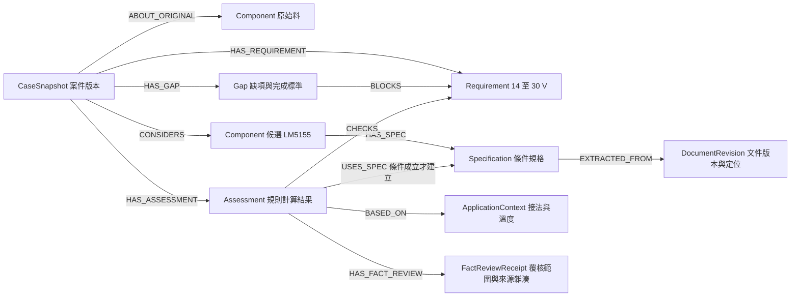
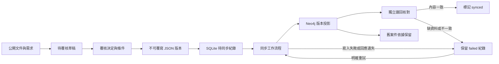
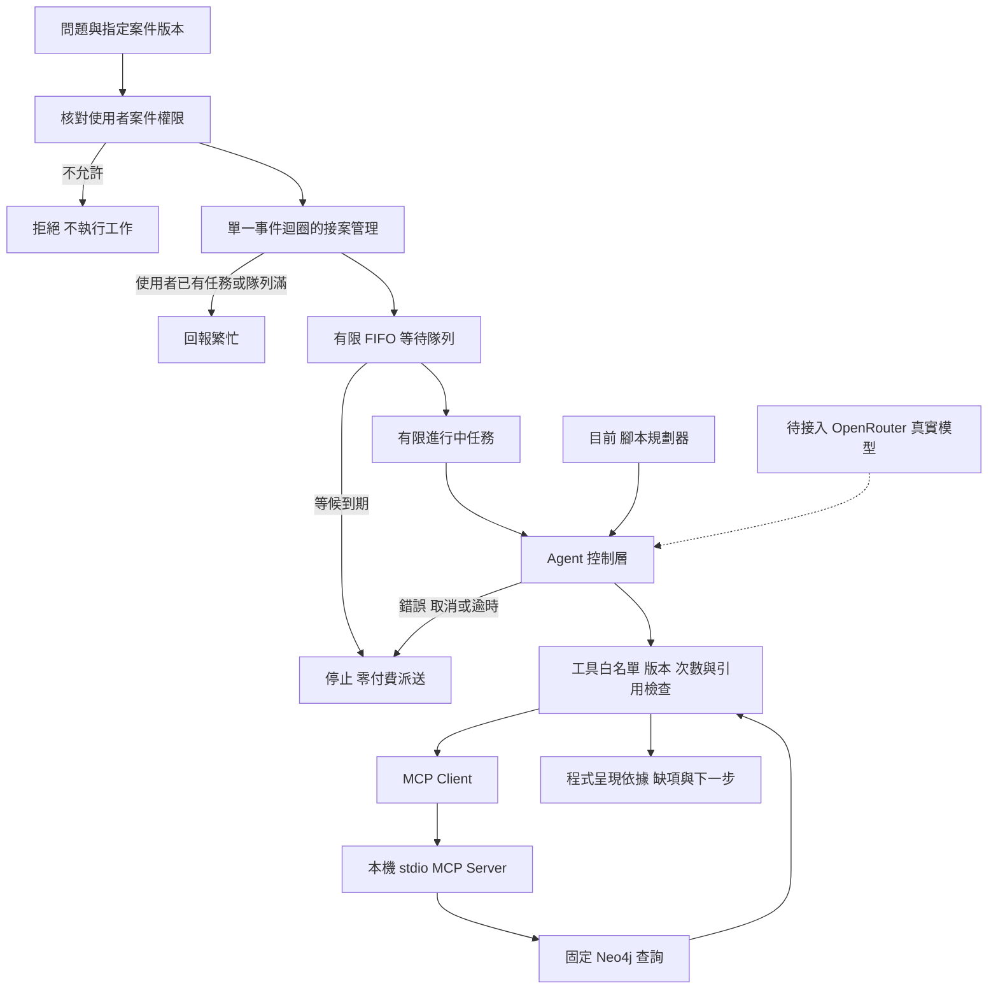
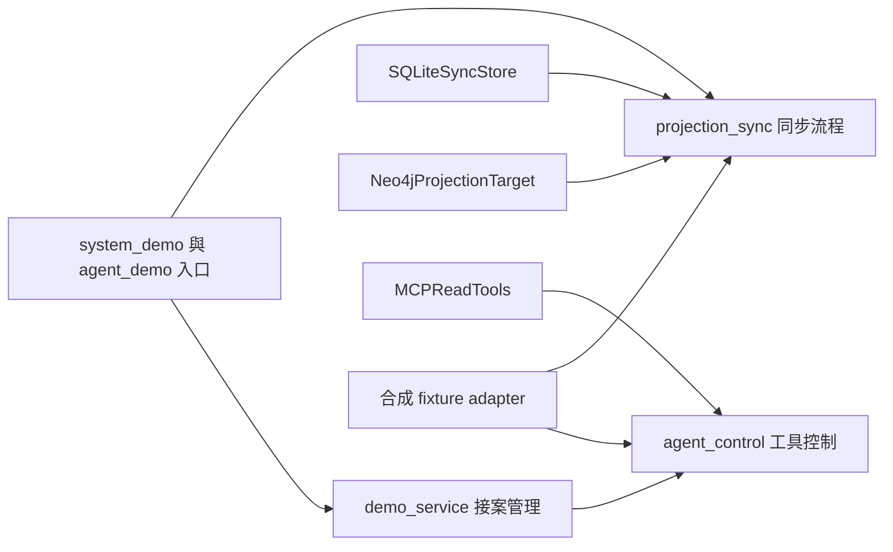

# 系統架構與展示範圍

這個專案協助查詢替料評估的依據、缺項與下一步。公開案例從 LT8301ESS 的替料提問出發，把 LM5155 當候選；不代表已驗證能替換。第一版只檢查有條件的 BIAS 建議工作電壓，來源規格仍待工程覆核。

## Neo4j 裡實際存什麼

不是只存「LM5155 可以替換 LT8301ESS」這一條線，而是保存某一版案件如何得到判斷。下圖對應目前投影的 9 種節點、12 種關係；不同階段只會建立有依據的部分，未知結果不建立 `USES_SPEC`。

規格跟條件、文件版本分開，才能回答「這次用哪條規格？為什麼適用？來源更新會影響哪些判斷？」。案件與判斷綁定來源雜湊，舊版不覆寫。缺項不是空白欄位，而是有原因、下一步與完成標準的節點。

數值判斷由版本化程式規則執行；MCP 提供唯讀證據。模型未來可以協助規劃查詢與解釋，不能代替工程覆核或自行授予替料核准。來源 `pending` 與示範中的合成覆核 receipt 也不混成「原廠規格已獲工程認證」。

## 覆核版本與同步恢復

目前能展示全部路徑。覆核者和應用接法是明確標示的合成資料；SQLite 是真實本機資料庫。預設使用假圖儲存，隔離模式才連真實 Neo4j。

JSON bundle 是這次示範的原始依據，SQLite 記錄同步工作，Neo4j 保存可重建的查詢投影。三者不是單一交易：保存 bundle 後若尚未建立工作就中斷，需要明確重新 enqueue；執行中的 worker 若直接崩潰，syncing 狀態需操作員確認舊 worker 已停止後處理。Demo 不宣稱已完成自動 crash recovery。

回應遺失的情境會先提交圖資料，再注入回應遺失，留下 failed 工作。重開 SQLite 並重試後，對比完整讀回結果；真實資料庫測試也比較重試前後的節點與關係，確認沒有重複資料。

## 多人任務與 Agent 控制

MCP／Neo4j 分支有獨立真實邊界測試。新增的多人 demo 使用合成身分、受控延遲工具及腳本規劃器，測接案、排隊與取消；它不經真實 MCP transport，也沒有登入、OAuth 或遠端 HTTP MCP。因此不能拿它的延遲當作真實模型或正式多人服務的效能。

展示設定是同時 2 個任務、最多 4 個等待、每個合成身分最多 1 個尚未完成的任務。10 個不同身分同時提交，預期 6 個接案、4 個繁忙；排隊與總耗時由每次執行實際量測。每個任務分開建立 planner、controller state，避免共享「目前案件」。

## 模組與依賴

箭頭表示入口呼叫與 adapter 配合流程；workflow 只依賴意圖明確的 ports，不直接匯入 SQLite、Neo4j 或 MCP SDK。核心使用 Python 標準函式庫，MCP SDK 是鎖定版本的可選邊界依賴。

## 延遲與成本仍要補的部分

目前量測 demo 的排隊與整體耗時、接案結果和尖峰任務數。下一階段才接個別模型與資料庫名額、送出前預算保留、供應商用量結算及真實模型評測。單程序限制沒有跨 worker／replica 的全域保證。

真實模型規劃最多兩次推論的設計仍待實作。逾時後遠端工作和費用可能未知，不能把本機取消當成零費用。案件 ID 也不是存取權證明；目前合成政策測試不是正式身分驗證。

參考：[MCP 工具規範](https://modelcontextprotocol.io/specification/2026-07-28/server/tools)、[MCP 授權](https://modelcontextprotocol.io/specification/2026-07-28/basic/authorization)、[OpenRouter 工具呼叫](https://openrouter.ai/docs/guides/features/tool-calling)。
