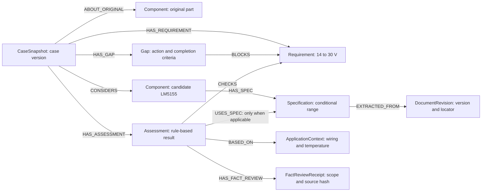
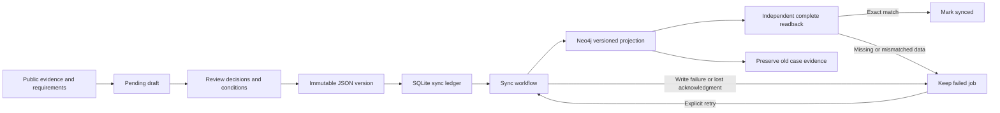
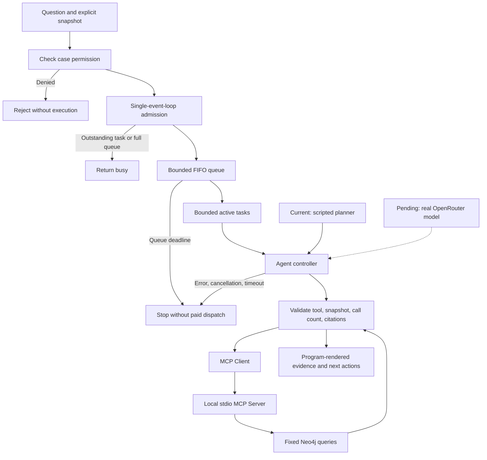
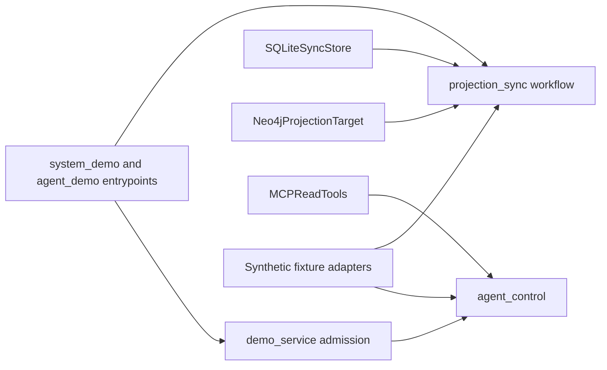

# System architecture and demo scope

This project retrieves the evidence, gaps, and next actions for a component-replacement assessment. The public case asks about replacing LT8301ESS and considers LM5155; no replacement has been approved. The first implementation checks only the conditional recommended BIAS operating-voltage range. Source facts remain pending engineering review.

## What Neo4j stores

The graph does not contain an unconditional "LM5155 replaces LT8301ESS" assertion. It records how a particular case version reached its assessment. The diagram maps to nine node types and twelve relationship types. Each stage creates only supported evidence; unknown assessments do not create `USES_SPEC`.

Keeping specifications, conditions, and document versions separate lets us ask: which specification was selected, why was it applicable, and which assessments could a source update affect? Cases and assessments bind to source fingerprints; old versions are not overwritten. A gap is a reason, next action, and completion criterion, not an empty cell.

Versioned deterministic rules perform numerical comparisons. MCP supplies read-only evidence. The optional model planner chooses evidence tools and fetched bundles; the server binds exact references and the controller independently checks completeness. It cannot replace engineering review or grant replacement approval. A synthetic receipt does not turn a pending source draft into an engineering-certified datasheet.

## Review versions and sync recovery

The demo exercises these paths with explicitly synthetic reviewers and wiring. SQLite is real local storage. The default graph is fake; isolated mode uses real Neo4j.

The JSON bundle is the source of truth, SQLite tracks sync jobs, and Neo4j stores a rebuildable query projection. They do not share one transaction. A crash after saving the bundle but before enqueueing requires explicit re-enqueue. A worker crash can leave syncing blocked until an operator confirms the old worker has stopped. Automatic crash recovery is not implemented.

The lost-acknowledgment scenario commits graph data and then injects failure, leaving the job failed. After reopening SQLite and retrying, complete readback is compared. Real DB tests also compare nodes and relationships before and after retry to detect duplicates.

## Concurrent tasks and Agent controls

MCP and Neo4j have a separate real-boundary suite. The concurrent-task demo uses synthetic identities, controlled-delay tools, and a scripted planner to test admission, queueing, and cancellation. It does not traverse real MCP transport or implement login, OAuth, or remote HTTP MCP. Its latency is not real-model or production multi-user performance.

Demo limits are two active tasks, four waiting, and one outstanding task per synthetic identity. Ten different identities submit simultaneously: six admitted and four busy. Queue and total duration are measured per run. Each task creates its own planner and controller state, with no shared "current case."

## Modules and dependencies

The separate [local authentication entrypoint](local-auth.md) verifies synthetic credentials in SQLite, derives a principal from the persisted session, and checks an explicit grant and case tenant before admission. It rechecks authorization before and after each evidence tool and before returning an answer. AuthenticatedReview depends on the Authorization port; SQLiteAuth owns session/password mechanics. The automated auth demo uses fixture evidence and a non-paid provider-shaped planner with the shared synthetic budget. It does not add authentication to the stdio MCP server or create a network service.

Arrows show entrypoint calls and adapter collaboration. Workflows depend on intention-revealing ports rather than directly importing SQLite, Neo4j, or MCP SDKs. The core uses the standard library; the pinned MCP SDK is an optional boundary dependency.

## Remaining latency and cost controls

Current measurements cover demo queue/total duration, admission outcomes, peak active tasks, and separate MCP handler phases. The MCP server has one read permit per process, but its waiting callers are not bounded. The separate [model-interface fixture](model-interface.md) implements pre-dispatch reservation and settlement/unknown-exposure handling with synthetic amounts. A later authorized trial additionally recorded current endpoint quotes and provider-reported costs; invoice reconciliation, per-model permits, shared database capacity and model-quality evaluations remain pending. Single-process limits provide no cross-worker or replica guarantees.

The optional [SQLite budget adapter](shared-budget.md) adds persistent reservation accounting across processes sharing one local file on the same host. This is separate from admission/queue limits, which remain single-process. BudgetPort keeps database mechanics outside the controller; short write transactions end before provider work begins. This adapter is not a distributed budget, authentication layer or live billing cap.

## MCP delivery contract

The [three tools](mcp-contracts.md) accept only an exact snapshot ID. Unknown names are rejected as protocol errors before application dispatch. Application validation precedes fixed Neo4j queries; tool-specific output schemas reject malformed nested evidence before it can be returned as success. Existing projections and unknown states remain readable, while engineering approval is always false.

Handler metadata separates queue, execution and validation time from evidence. Execution includes worker dispatch and DB waits, not only query execution. It excludes SDK framing, transport and model latency. No end-to-end latency or global capacity guarantee follows from these measurements. A read-only annotation describes intent; fixed queries are an application guard, not a database-role or authentication guarantee.

The original two-response provider adapter defaults to a non-paid fixture transport. A later optional [authenticated bounded Agent](bounded-live-agent.md) adds an explicitly enabled HTTP adapter and portal action. The [later in-app-browser trial](browser-live-verification.json) completed two real model requests and MCP evidence reads, but supplied only two of four mandatory references. The controller rejected the incomplete result. A valid live answer and Chrome acceptance are still missing; in-app-browser evidence does not waive the Chrome gate. The earlier key401 remains a historical checkpoint. After a timeout, remote work and charges may remain unknown; local cancellation does not prove zero cost. A case ID is not access authorization, and a synthetic policy test is not production authentication.

The optional [SSO and protected HTTP MCP slice](sso-mcp-oauth.md) adds a separate network entrypoint: browser → portal BFF → fixed Keycloak issuer → resource-bound MCP token → server-owned issuer/subject case grants → fixed Neo4j reads. Tokens remain server-side. Its default launch is non-paid; the separate explicitly enabled Agent extension supplies live model transport. Neither slice changes trusted-local stdio or establishes corporate federation, multi-host session state or production HTTPS readiness. Verification must not be inferred from older stdio or local-login receipts.

The current finish wire selects already-fetched bundle tool names rather than reproducing source identifiers. The planner binds exact references, while the unchanged controller enforces reference completeness and consistency. Missing mandatory selections still stop; this is not a citation auto-repair. [Current fixture/real-evidence verification](evidence-bundle-verification.json) does not establish new paid-model success or browser acceptance.

References: [MCP tools](https://modelcontextprotocol.io/specification/2026-07-28/server/tools), [MCP authorization](https://modelcontextprotocol.io/specification/2026-07-28/basic/authorization), [OpenRouter tool calling](https://openrouter.ai/docs/guides/features/tool-calling).
