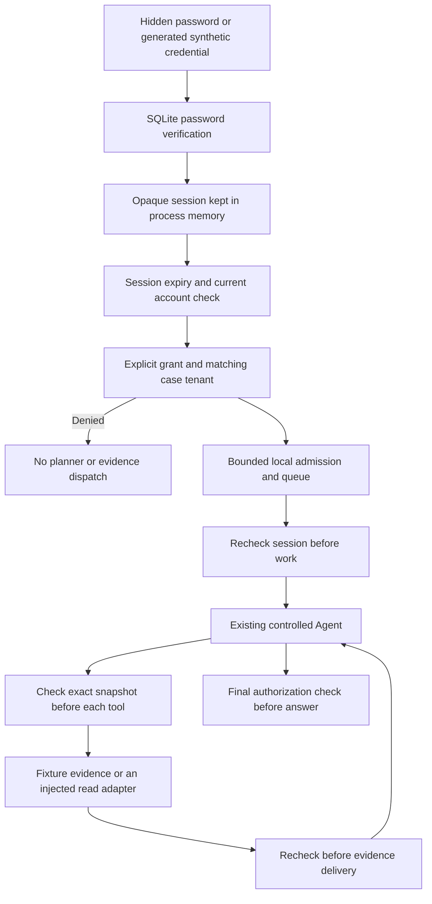

# Local login and case authorization

This slice adds real password verification and persistent server-side sessions to the local synthetic demo. It answers who may read which case before a planner or evidence tool runs. It is a CLI application, not a website, enterprise SSO or remote MCP OAuth server. Accounts, tenants and grants are synthetic; the database and session checks are real.

## Run the demo

Python 3.11+ and the standard library are sufficient. No key, Docker or network is needed. Use a new private output directory.

```sh
python auth_demo.py --simulate-users --out output/auth-01
```

The command generates credentials internally, performs actual logins and shows anonymous denial, cross-tenant denial, owner access, reviewer access to their own case, wrong-password refusal and replay refusal after logout. It never prints raw passwords or session tokens. Successful requests traverse the existing controller and provider-shaped fixture with the shared synthetic SQLite budget. Two successful runs account for simulated USD 0.004, not an actual charge. The graph and model are fixtures; no MCP transport is exercised by this command.

For hidden password prompts in a real local terminal:

```sh
python auth_demo.py --interactive --out output/auth-interactive-01
```

Set two new synthetic passwords of 15 to 128 characters; do not reuse real credentials. Use login, case-a, case-b, logout and exit. Account names are SIM-reader-A and SIM-reviewer-B. A reader can access only case-a; a reviewer can access only case-b. The interactive mode refuses non-interactive input. Its terminal interaction has not been manually verified; the automated command and application path have separate executed tests.

## Identity and authorization path



The authenticated principal contains the server-side user, tenant and role. Question text and tool arguments cannot change it. Case IDs are lookup identifiers, not capabilities. A grant alone is insufficient when the case belongs to another tenant. Both reader and reviewer may read only explicitly granted cases; neither role may approve engineering changes.

Session checks run before admission, after queueing, before and after every evidence call, and before returning the answer. Logout or expiry while queued prevents planner creation. Logout during a read suppresses its result and subsequent calls; the already-admitted read cannot be undone. This is not an atomic transaction between authorization, a remote query and revocation. Previously returned data cannot be recalled.

## Storage and failure contract

Passwords use independent random 16-byte salts and scrypt N=2^17, r=8, p=1, with a 128 MiB work setting and 256 MiB allocation ceiling. Argon2id is OWASP's preferred choice; the standard-library implementation uses its documented scrypt alternative. Verification uses constant-time digest comparison and does not truncate Unicode passwords. This is not a password-reset, MFA or compromised-password screening service. See [OWASP Password Storage](https://cheatsheetseries.owasp.org/cheatsheets/Password_Storage_Cheat_Sheet.html).

Sessions have 256 bits of generated entropy. SQLite stores only a SHA-256 verifier, never the raw token. A new login replaces the user's previous session. The default absolute lifetime is 900 seconds and idle lifetime 300 seconds; each issued session retains its own limits even if a later process uses different defaults. Expiry is checked server-side at use. Observed expiry and logout delete the session record; expired records are also pruned during login. There is no background cleanup guarantee. The clock and local store owner are trusted. See [OWASP Session Management](https://cheatsheetseries.owasp.org/cheatsheets/Session_Management_Cheat_Sheet.html).

The actual SQLite adapter uses its own application ID/version, foreign keys, FULL synchronous mode and BEGIN IMMEDIATE with a 100 ms busy timeout. A missing store fails closed rather than being recreated. Initialization refuses an existing file. Login rotation is transactional: failed session insertion leaves the old session intact. Grants and account state are reread, not cached in a pooled global identity.

A persisted database-wide bucket allows ten well-formed login attempts per 60 seconds, counting both success and invalid credentials. Malformed inputs are rejected before hashing. Unknown accounts use a dummy digest and the same public invalid_credentials error. The write transaction serializes expensive hashes within one database. This can block other auth checks and deny legitimate users under contention; it is a local resource bound, not production abuse protection or a latency guarantee. No memory fallback or automatic retry is provided.

## Privacy and trust limits

Raw tokens remain in process memory and are not passed to MCP or a model. Auth records are stored in ignored output directories. Logout deletes the current session; synthetic account hashes, grants and the demonstration budget remain locally for inspection until the operator removes the isolated directory. Row deletion is not secure disk erasure. No real personal accounts or account-deletion service are supported, and this demo transmits nothing to a third party.

The local file owner is trusted. This implementation does not install Windows ACLs, encrypt disks/backups, isolate hostile OS processes or provide a network security boundary. A process with write access to the auth database can change policy; someone with an application's in-memory token can act until expiry or revocation. Direct CLI/stdio tools remain available to trusted local operators; this wrapper does not retrofit authorization onto every repository command.

Remote deployment requires a separate trusted identity provider and HTTPS/OAuth design, credential lifecycle, appropriate scopes/audience, browser controls if applicable, and real integration tests. Local sessions do not prove remote MCP authorization. Queue/task capacity remains per process, independently of the same-host shared synthetic budget.

## Verification

```sh
python -m unittest discover -s tests -p test_local_auth.py -v
python -S scripts/verify_auth_guards.py
```

Tests exercise the application's actual SQLite schema, permitted and denied roles/tenants, password storage, token rotation, expiry boundaries, logout observed by another spawned process, in-flight revocation, queue cleanup, real locks and transaction rollback. They also run the actual automated CLI and inspect retained session and budget rows. Other graph/model boundaries are explicitly substituted. See the [verification record](verification.md#local-authentication-verification) for executed results and limitations.
