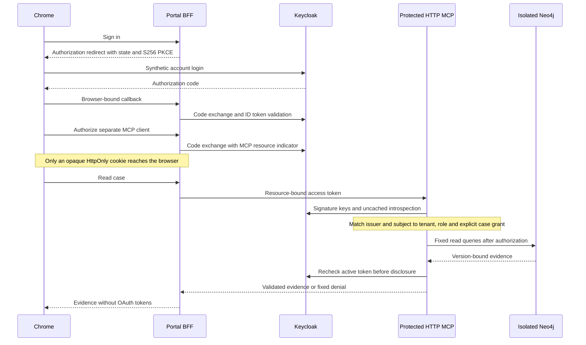

# Local SSO and MCP OAuth demo

This optional demo adds a real external identity provider and an OAuth-protected HTTP MCP service. Keycloak owns login and single sign-on. The application owns case permissions. It does not turn a successful login into permission to read every BOM case.

The later optional [bounded Agent action](bounded-live-agent.md) builds on this identity boundary. Its new source bytes and tests are separate from this document's earlier receipt. The [newer browser receipt](browser-live-verification.json) records an in-app-browser paid trial stopped for incomplete references, twenty SSO tests within the final suite, and real logout checks. Fixture execution is not paid-provider evidence, and in-app-browser checks do not waive Chrome acceptance.

Implementation and verification are separate. At the original checkpoint, seventeen local tests covered signed-token validation, server-owned grants, PKCE/state/nonce, HTTP discovery and denial, browser-session expiry, logout redirects and safe error responses. Real HTTP runs passed through Keycloak, the BFF, protected MCP and isolated Neo4j for both synthetic users, including cross-case denial and retained-token rejection after logout. After an intervening Docker outage, a new isolated synthetic rebuild passed the same chain again on 2026-10-04; Chrome acceptance remains incomplete. See [verification](verification.md) and the [source receipt](sso-mcp-oauth-verification.json) for time-bounded evidence.

## Trust boundaries



The portal and MCP clients are registered separately and share the IdP browser session. A third confidential resource client has no login or service-account grant; its identifier equals the MCP resource URL. Both MCP authorization and token exchange include that exact resource. The MCP service accepts only RS256 access tokens with the configured issuer, exact resource audience, expected requesting client and read scope, then introspects using the resource client's credentials. This matches Keycloak 26.8.0's audience check without disabling that check globally or per client. Explicit subject mappers include `sub` in access tokens and introspection. An ID token authenticates a client login; it is not a token for calling MCP.

Case access uses a server-owned `(issuer, subject)` mapping. A matching scope is necessary but insufficient: tenant, reader role and explicit snapshot grant must also match. These guards run before the database query and again before returning evidence. User IDs supplied in a request do not establish identity. No user bearer token is forwarded to Neo4j or a model provider.

OAuth authenticates the current reader; it does not retrospectively authenticate a historical reviewer or approve extracted specifications. Existing snapshot reviewer declarations and engineering-review requirements remain unchanged.

## Start the isolated demo

Install the existing pinned optional MCP dependencies from `uv.lock`. Docker Desktop must be running and loopback ports 18880–18883 must be free. The launcher does not replace existing containers or shared databases.

```sh
uv sync --extra mcp --frozen
docker pull quay.io/keycloak/keycloak@sha256:b0f60d489d51c5d113390bdf5461d4c06e6051be026c05549f2e1e10ec352bcc
docker pull neo4j@sha256:89d577f2e49606de76441eca8cf7a0fe88e594cbaac4d2a3d86c6e59676e2b1e
uv run --extra mcp --frozen python scripts/start_sso_demo.py --isolated
```

Open `http://localhost:18882`. The launcher prints the path to ignored private synthetic account credentials, not their values. Use `demo-a`, then authorize the separate MCP client. Case A should return `matches_requirement`; case B must disclose no evidence. Sign out everywhere, follow `Finish SSO sign-out`, and complete an IdP confirmation if shown. Confirm Signed out, then repeat with `demo-b`: B should return `violates_requirement`, and A must be denied. Neither result is whole-circuit approval.

The owned Keycloak container enables experimental `resource-indicators` in version 26.8.0. The owned Neo4j container uses Community 5.26.29. Both are digest-pinned. The local launcher limits them to 1 GiB/2 CPUs and 2 GiB/2 CPUs respectively; these are upper limits, not reserved host resources or performance guarantees.

The protocol harness exercises real HTTP services using the synthetic login form and authorization-code flow. Its test client explicitly substitutes the Secure-cookie localhost exception described in [MDN cookie documentation](https://developer.mozilla.org/en-US/docs/Web/HTTP/Guides/Cookies), while retaining domain/path/expiry checks and restricting destinations to the three local demo ports. This does not modify Keycloak Cookie flags or runtime security settings, and does not substitute for Chrome UI verification:

```sh
uv run --extra mcp --frozen python scripts/verify_sso_live.py --isolated-output output/sso-demo-RUN_ID
uv run --extra mcp --frozen python -m unittest discover -s tests -p test_sso_oauth.py -v
uv run --extra mcp --frozen python scripts/check_sso_guards.py
```

Keep the launcher running during verification. Ctrl+C requests shutdown of only its owned Python children and containers. It does not delete containers, volumes or output files. Confirm shutdown from actual container state; a startup receipt is not proof of readiness or cleanup. Credentials remain in ignored private output files and Docker configuration until a separately checked cleanup.

## Failure and retention rules

Tokens remain in a bounded single-process memory vault. Portal sessions expire after 15 minutes; pending OAuth state expires after five minutes and is single-use. Access tokens expire after two minutes, and automatic refresh is deliberately not implemented. An expired token requires authorization again. Logout drops portal credentials, revokes refresh tokens, and uses a same-origin, expiring cookie-bound handoff before the fixed IdP link. Its browser-bound `state` is a separate endpoint parameter, as specified by [OIDC RP-Initiated Logout](https://openid.net/specs/openid-connect-rpinitiated-1_0.html), not embedded in the return URI. The IdP may request confirmation; complete it if shown. No ID token is put into the logout URL. A retained access token must be tested after logout; local cookie deletion alone does not prove revocation.

Provider errors and inactive tokens fail closed. Introspection has no active-token cache; this adds IdP latency and an availability dependency. The verifier allows four concurrent checks, the portal allows two operations, and each local HTTP worker caps accepted concurrency at sixteen. These controls are per process, not global admission control or measured production capacity. The MCP database reader still has one read permit per process.

Only synthetic identities and case data are used. No paid model or third-party model sharing occurs. Responses suppress OAuth credentials and provider exceptions. Private configuration, account credentials, logs and raw verification artifacts stay in ignored `output/`; do not upload them.

## Explicit limits

Loopback HTTP is a development exception, not production HTTPS compliance. The Cookie uses HttpOnly and SameSite Lax for the OAuth redirect; production must use Secure cookies and TLS. Local Keycloak SSO is not corporate SAML/OIDC federation. Experimental resource indicators, single-process session state, no refresh, static synthetic grants, database administrator credentials behind fixed read queries, and unverified HA/image advisories prevent a production-ready claim. Existing trusted-local stdio remains separate and does not acquire HTTP OAuth protection.

The executed real-chain run used a checked warm restart after the fresh containers exceeded their 900-second readiness limit. It does not prove reliable fresh startup. Real wall-clock token expiry, provider-outage recovery and role changes were not exercised on that live chain; local guard tests cover narrower expiry/outage/role invariants. Browser login and follow-on interactions are still a required acceptance gate.

A later fresh isolated rebuild reused the retained images and synthetic account seed after the old named containers were confirmed absent. It recreated the schema and synthetic cases rather than restoring the old database; private server grants were bound to the new snapshots. Readiness took 278.740 seconds, and the unchanged HTTP harness passed again. This single observation does not establish cold-start reliability or automated outage recovery. Browser automation was unavailable during this recovery, so the signed-in Chrome path remains unverified.

Sources: [MCP authorization 2026-07-28](https://modelcontextprotocol.io/specification/2026-07-28/basic/authorization), [Keycloak MCP authorization server](https://www.keycloak.org/securing-apps/mcp-authz-server), [RFC 8707 resource indicators](https://www.rfc-editor.org/rfc/rfc8707.html), [RFC 9728 protected resource metadata](https://www.rfc-editor.org/rfc/rfc9728.html), [RFC 7636 PKCE](https://www.rfc-editor.org/rfc/rfc7636.html).
